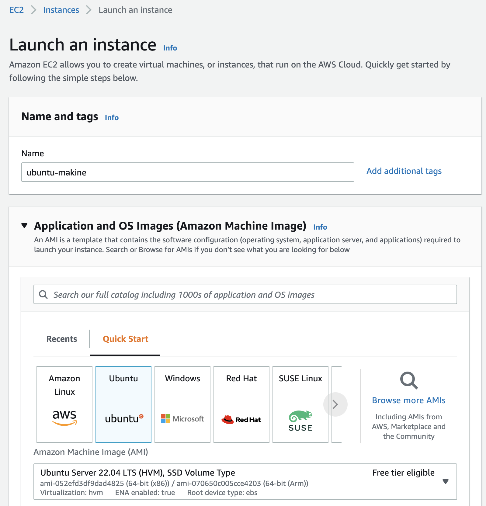
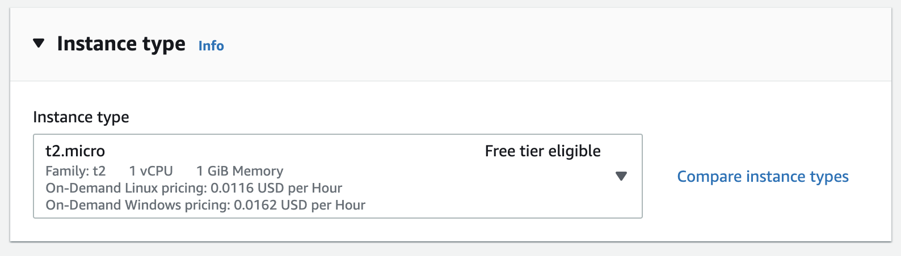
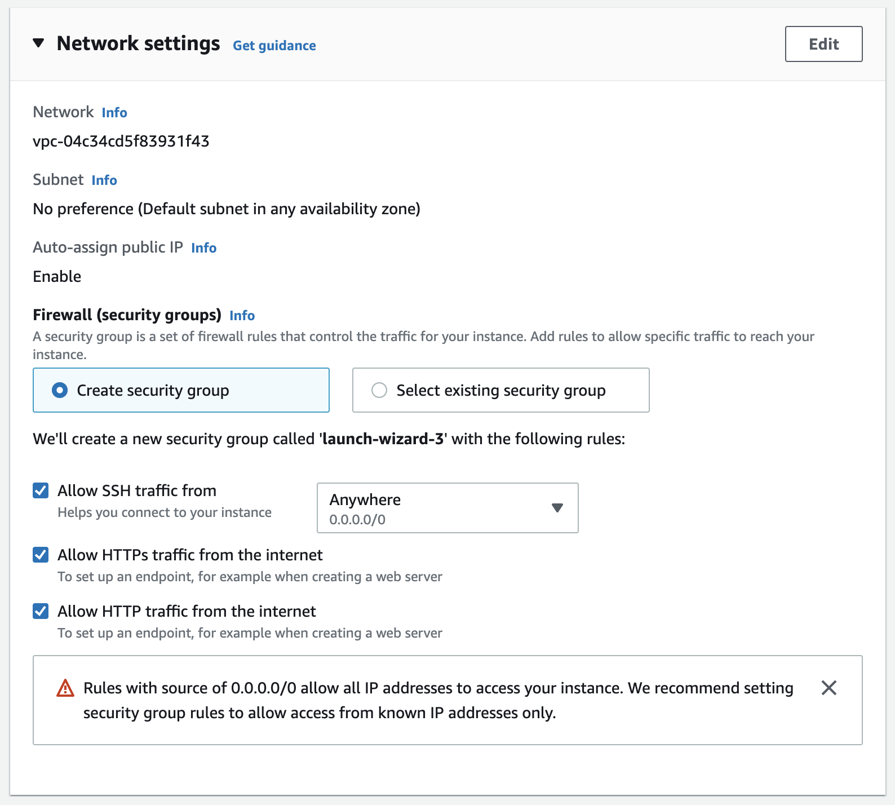
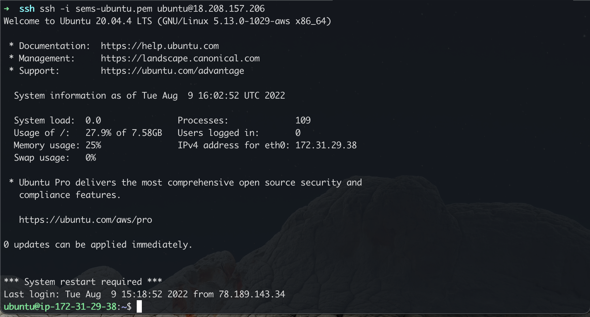
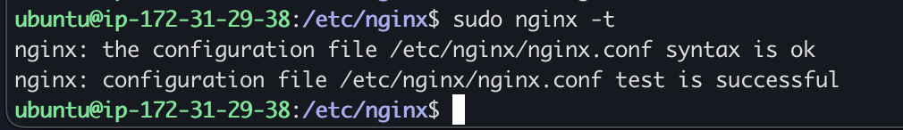
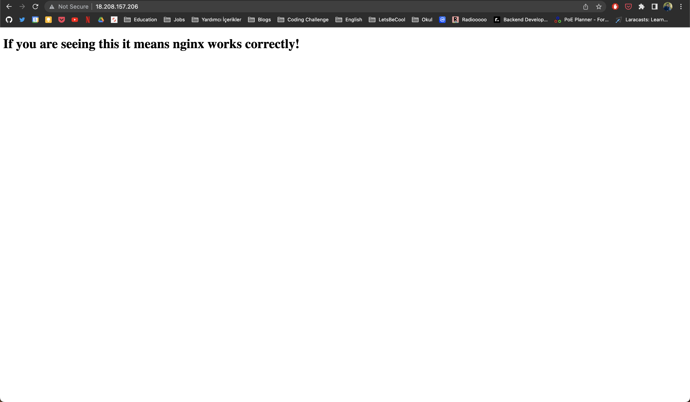

# Nginx ile HTML dosyası serve etmek
Bootcamp kapsamında öğrendiğim bilgilerle ufak bir alıştırma yapmak için bir fikir düşündüm ve nginx konusuna da değindiğimiz için static bir html dosyayı serve etmek başlangıç için güzel olabilir.

#### AWS EC2 ile Ubuntu makine oluşturuyoruz
Öncelikle bir ubuntu makine oluşturuyorum. Zaten bu adımı AWS konsolda çok kolay yapabilirsiniz. 

EC2 servisini bulun, Launch instances butonu ile bir instance oluşturun. Ve hepsi bu kadar elinizde ubuntu bir makine var.

Ubuntu Server 22.04 seçtim. Ben 1 yıllık ücretsiz kullanım hakkım olduğu için free tier eligible seçenekleri kullanıyorum.


Yine Instance type’ı da ücretsiz olan t2.micro seçiyorum. Bu sistem uygulamamız için yeterli olacaktır.


> ⚠️ **Ufak bir not** 
> Benim gibi yeni öğrenen biriyseniz AWS konsolda http 80 portunu açmayı unutmayın:)

> **Network settings kısmında önemli bir detay var:**
> ’**Allow HTTP traffic from the internet**’ seçeneğini aktif ediyoruz, eğer bu seçeneği aktif etmezsek browser üzerinden server’a erişim sağlayamayız.  
> Ve tabii ki **SSH**’ı da servera bağlanmak için aktif ediyoruz.  


Ayarlarımız bu kadar, **Launch instance** tıklayarak makinemizi oluşturabiliriz.

Makineniz oluştuktan sonra indirdiğimiz .pem uzantılı bir dosya ile ssh bağlantısını sağlayabileceğiz.
Instances alanında üzerine tıklayarak public IPv4 address kısmından ssh ile bağlanacağınız ip adresini öğrenebilirsiniz.

#### SSH ile bağlantı kurmak
> Bootcamp notlarımda bununla ilgili komutlar var. [Day#2](../day-2/README.md)

AWS ubuntu makinelerde default kullanıcı adı: **ubuntu**.
```bash
ssh -i pem-dosyaniz.pem ubuntu@ip-adresiniz
```

Eğer bir sorun olmadıysa konsol ekranına erişmiş olmanız gerekir.


#### nginx kurulumu
Öncelikle nginx paketine ihtiyacımız var
```bash
sudo apt update
sudo apt install nginx
```

> **Not**
> nginx kurduğumuzda aktif hale gelecektir. Eğer browserdan ip adresine girmeye çalışırsanız aşağıdaki gibi bir sayfayla karşılaşmalısınız.
> 

Eğer direk başlamadıysa şu komutla nginx’i başlatabiliriz
```bash
systemctl start nginx
```

Sistemde nginx servisinin durumunu görüntülemek için yine notlarımdaki komutları deneyebiliriz.

Aşağıdaki komut ile çalışan servisler arasında nginx’i filtreleyebilirsiniz.
```bash
systemctl list-units | grep nginx
```

#### nginx config
Bu adımlar sonrasında nginx default sayfasını görebildiysek bir html dosyası oluşturarak nginx config’ini yapabiliriz

İlk olarak `/home/ubuntu `  dizini altında  `www` adlı bir dizin oluşturarak içerisinde html dosyası oluşturacağım.
```bash
mkdir www
cd www
touch index.html
```

Ve html dosyasını düzenlemek için vim ile açacağım
`sudo vim index.html`

Vim içerisinde `i` ile INSERT moduna geçiyoruz ve html kodlarını ekliyorum
```html
<!DOCTYPE html>
<html lang="en">
<head>
  <meta charset="UTF-8">
  <meta http-equiv="X-UA-Compatible" content="IE=edge">
  <meta name="viewport" content="width=device-width, initial-scale=1.0">
  <title>Nginx Works!</title>
</head>
<body>
  <div>
    <h1>If you are seeing this nginx works correctly!</h1>
  </div>
</body>
</html>
```

> `:wq` ile kaydederek vim’den çıkıyorum.  

html dosyasını da oluşturduğumuza göre config’i yapabiliriz.
`/etc/nginx/nginx.conf` dizininde config dosyasını bulabilirsiniz.  

`sudo vim /etc/nginx/nginx.conf`
http içerisine aşağıdaki server kısmını ekliyoruz
```
server {
    listen 80;
    server_name ip-adresiniz;
    root /home/ubuntu/www;
    index index.html;
}
``` 

> `:wq` ile kaydedip çıkıyoruz.  

config dosyasını test etmek için `sudo nginx -t` çalıştırıyoruz.


Ve son olarak `sudo systemctl restart nginx` komutu ile nginx’i yeniden başlatıyoruz.

Tarayıcıdan ip adresinize ulaşmaya çalışırsanız başarılı şekilde html dosyasını görebilirsiniz 🎉




